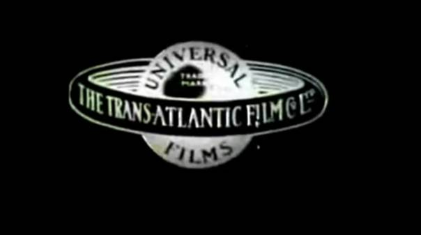
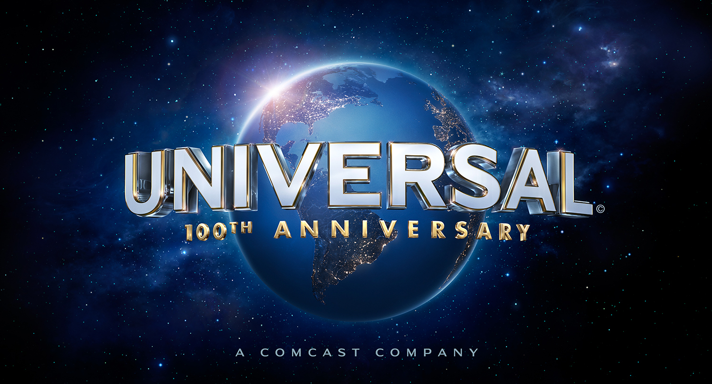
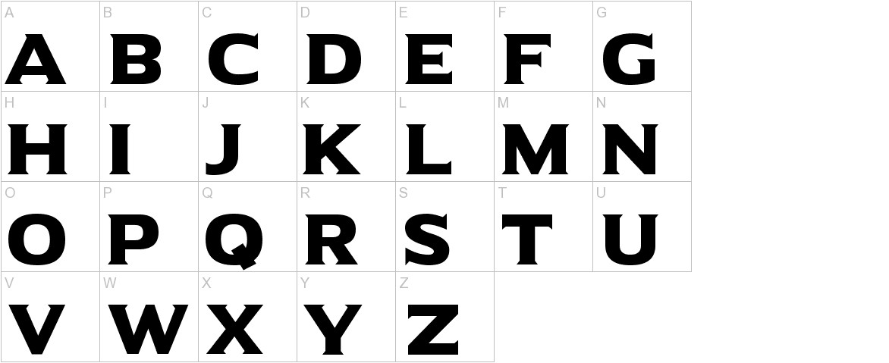

Owned by Comcast and founded in 1912 by Carl Laemmle, Universal Studios is a film production company that has (probably) produced some of your all-time favourites. As a part of the "Big Five" Universal is one of the most successful film studios out there.

Despite its 100+ years and many, many logo updates its overall *feel* has remained a constant since its inception. 

## (1914 - 1919)

For obvious reasons, I won't do *all* of the Universal logos or we'd be here until Christmas (if that's still happening?). Anyway, the first logo and all the others since show a planet (maybe Earth?) with the company name curving to fit around the globe being displayed. The other words which formed a ring around the 'globe' resemble a Saturn-like ring.

## (2012 - current)

The most recent logo bears much of the same feel that the first Universal logo had - now with an image of the Earth and the large, white company name placed in front of the Earth.

## Universal Serif

The name of the font used is, un-ironically, named Universal Serif. The letters are bold-like and wide, almost looking spaced out and the edges of the lettering have sharp-like edges. The typography is also eye catching as it is large, at the forefront and spread across the screen.