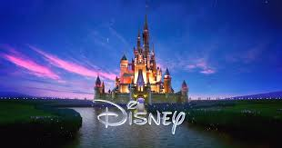
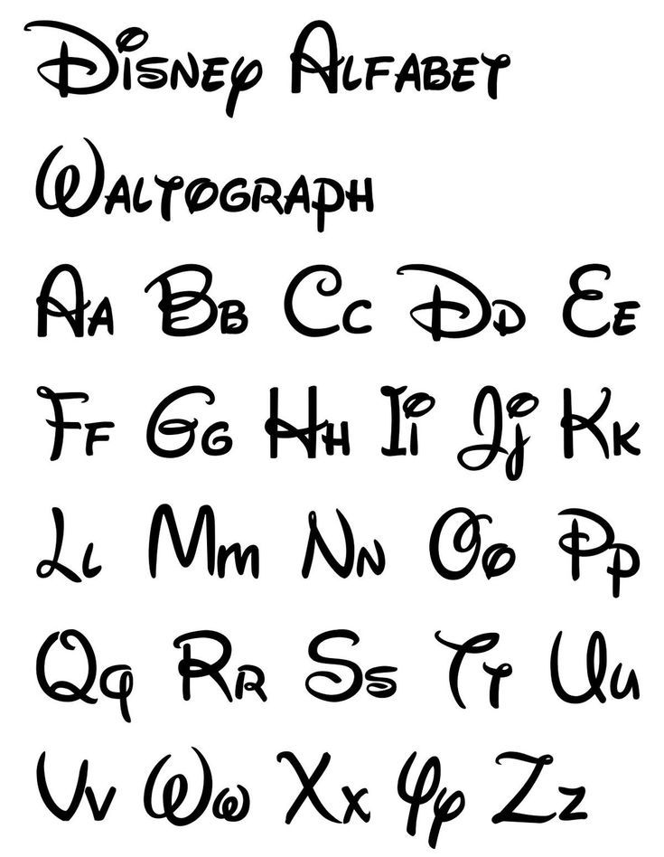

Disney, Disney, Disney - not a soul in the world doesn't know what Disney is... but I'll still tell you anyway (Otherwise, what am I here for?). *The* (Yes, 'The', so fancy) *Walt Disney Studios*, founded in 1923, is an American (Surprise, surprise) film and entertainment studio and a segment of the Walt Disney Company. Like Universal, it is part of the 'Big Five' major film studios - (FUN FACT: I'm pretty sure Disney owns all of your favourite film franchises now).

With their origins rooted in content and products aimed at children (still very much so now as an overall 'family company'), the logo and typography over the years retains a 'fantasy' and 'childlike' feel. Just above its typography is, what seems to be a black or white, depending on what version this is, castle which conveys the fantastical elements associated with the brand and its products. Just below it is the typography, and with the handwriting style it gives it a childlike feel as I mentioned earlier.

Now, going into more depth regarding its typography, it was initially believed to be the handwriting of Walt Disney himself but has been disproved (another fun fact). Coined as Waltograph, the typography itself seems very much relaxed and features a soft, curvy type looking similar to handwriting of sort, possibly a derivative of cursive with its own 'flair'? In terms of typographic voice, I feel that Waltograph is organic, due to the cursive-esque style. Empathetic in regard to the relaxed, almost friendly look. In the middle of both luxury and squalor, it does not look unpleasant but it also has a smooth style which leans near luxury. Waltograph is casual in the fact that it looks similar to one's handwriting. 

