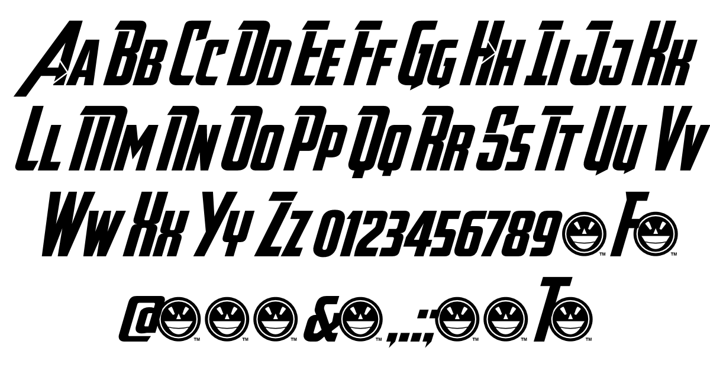

Slightly departing from my previous blog posts, I want to focus on an actual *movie* logo instead of a movie company one and what better to start off with than the series that changed the game for modern films - *The Avengers.* Serving as the sort of, glue or lynchpin for the *Marvel Cinematic Universe* I chose to focus on this series of films as opposed to the other franchises in the MCU.

