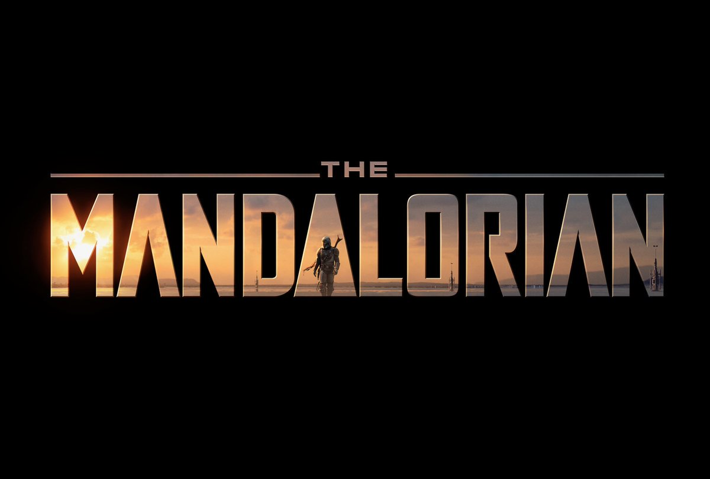
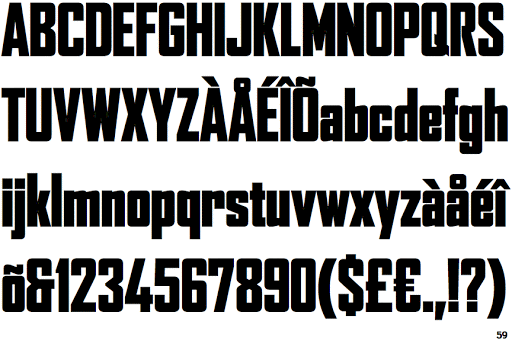

The Mandalorian, arguably one of the most talked about streaming shows currently which spawned one of the most beloved pop-culture characters, Baby Yoda, or, SPOILERS - Grogu. The Mandalorian is a streaming series set within the vast Star Wars universe and one of Disney+'s premiere titles/series, created by both Jon Favreau and Dave Filoni (who is practically Star Wars' second coming).

The Mandalorian's typeface is quite simple, but the logo itself has a lot going on for it. As shown above, you can see that the Mandalorian's typography serves as, sort of, a window that looks into the world of the TV show - with the title character serving as the second 'A' in 'Mandalorian' as he walks through what seems to be a desolate planet. The planet's sun shines through the logo and in a way, it looks as if the sun's rays are lighting up the logo. The logo is very creative.

Rounding back to the typface, it seems that it is derived from or, at the very least, inspired by a capitilised and boldened version of Font Bureau's Agency Black. As mentioned before, the typeface is simple but due to everything that is going on within the logo itself, it remains not only eye-catching but also recognisable - especially with the title character serving as the Agency Black's 'A' instead of using a traditional 'A'.

All in all, The Mandalorian's logo and typeface is interesting and eye-catching with its style meeting the aesthetic of the show.

