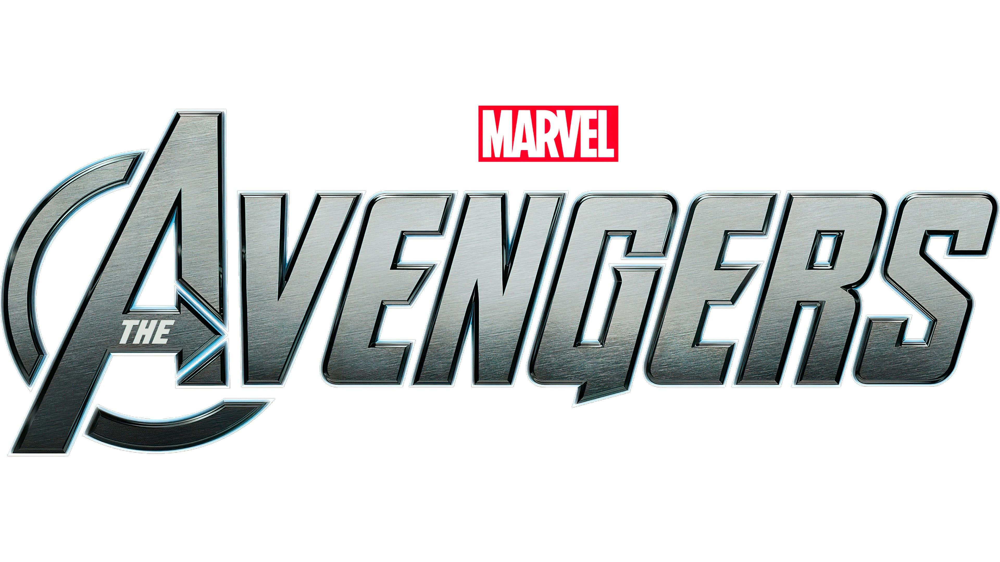

The Avengers, a franchise within another franchise; the Marvel Cinematic Universe. Based on the comic book of the same name the Avengers is the MCU's most profitable franchise as globally, the Avengers franchise has earned $7.768 billion at the box office and not only that, redefined the superhero and film landscape as a whole with every major film studio and their mother desperately trying to recreate that success with their own cinematic universes.

*Avengers Endgame*, the most recent installment in the Avengers franchise is currently the highest grossing film of all time.

Like any other great and recognisable franchise, it must come with a great and recognisable logo. Used across all type of Avengers media, and not just the films, the Avengers logo has a basic but recognisable logo that almost anyone in the world can spot. 

The typeface has an epic and heroic feel to it, it is bold and