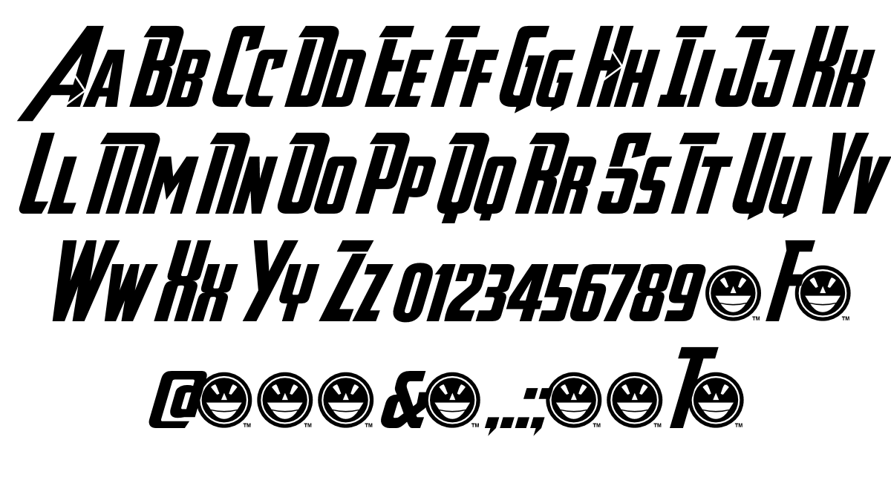

The Avengers, a franchise within another franchise; the Marvel Cinematic Universe. Based on the comic book of the same name the Avengers is the MCU's most profitable franchise as globally, the Avengers franchise has earned $7.768 billion at the box office and not only that, redefined the superhero and film landscape as a whole with every major film studio and their mother desperately trying to recreate that success with their own cinematic universes.

*Avengers Endgame*, the most recent installment in the Avengers franchise is currently the highest grossing film of all time.

Like any other great and recognisable franchise, it must come with a great and recognisable logo. Used across all type of Avengers media, and not just the films, the Avengers logo has a basic but recognisable logo that almost anyone in the world can spot. 

The typeface, also known as the Avengeance, has an epic and heroic feel to it with its solid aesthetic and bold letters. All the letters are capitalised with an Italicized-like font as the letters of the typeface are slanted to the right slightly. Interestingly the A in the logo has the most going on with it - the Avengers 'A', which is also the initial most recognisable with the logo, the two slanting triangles which form the 'A' the left slant is noticeably longer than the right one with a bold curved line, matching the rest of the typeface, displayed next to it which starts from the top of the left slant and curves behind the lower left slant before coming to a halt just under the 'V'. Meanwhile, the right slant has what looks similar to an arrow head fitted inside the slant. The horizontal bar, that crosses through the two slants has a smaller version of the typeface fitted inside of it with the words 'The' that makes up 'The Avengers' title. As the letter with the most going on with it, the 'A' in Avengers makes sense as the most recognisable aspect of the logo, even without the rest of the letters making up the name.

Below, you can see other letts in the Avengeance font family.

