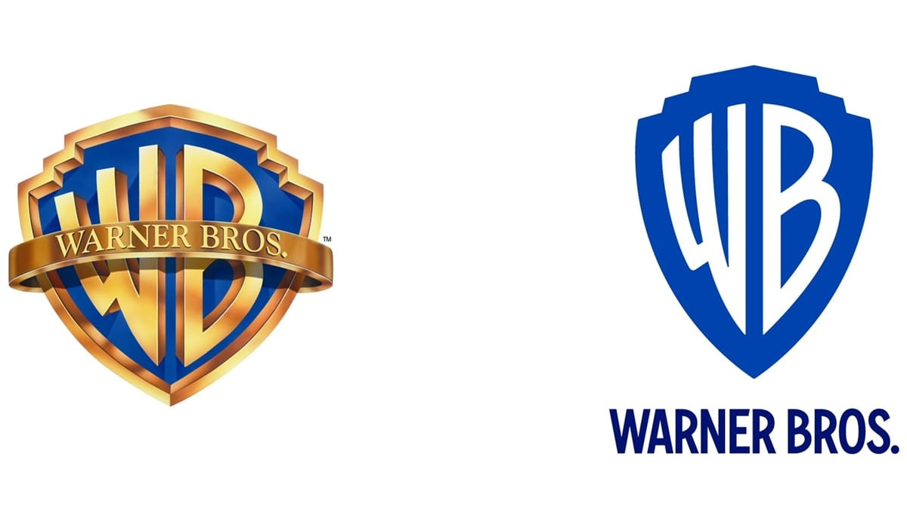
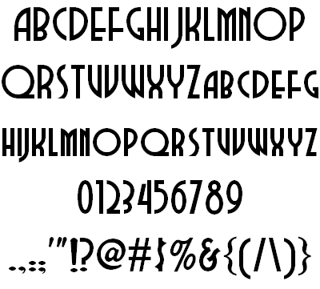

Warner Bros. or Warner Bros. Entertainment is a film production and distribution company and a prominent member of the 'Big Five' major American film studios. Founded in 1923 by the, yep you guessed it, Warner brothers; Harry, Albert, Sam and Jack L. Warner and the studio, alongside its other 'Big Five' member Disney has produced and distrobuted iconic media. Media such as *Looney Tunes*, the *Harry Potter* franchise, the *Lord of the Rings* franchise, *Superman* films, *Batman* films and much, much more.

Although, recently, its been dubbed in a negative light by the inernet community following its firing of Johnny Depp from the *Fantastic Beasts* franchise amidst Depp's and Amber Heard's controversial trial. Hence the article's title.

Since its inception Warner Bros. has been through a multitude of logo changes, of course it's only natural seeing as the studio has existed for 97 years but for this article I will be focusing on the most recent logos, the previous logo which had been in use from 1984 all the way up until last year and I will compare it to the newest incarnation of the WB logo.

For starters, the 1984 logo is more interesting and has a lot of depth going for it. Retaining the imagery of all the previous logos, the studio's initials 'WB' are golden and placed inside a golden shield witha blue background, the studio's full name, also gold, stretched across the front of the initials in a sash with pleasant looking clouds serving as the backdrop. The recent logo retains the same theme that has been used for years, but much more simplified, the initials are placed inside the shield - although, the shield has no borders unlike the previous logo but retains the blue background of the older logo. Also, unlike the previous logo, the newer one does not have the studio's full name stretched across the front of the studio's initials but instead are displayed at the bottom of the modern logo.

The studio's newest typeface retains the feel of the older logos but has been more streamlined to fit in with this Digital Age we are currently residing in. The typeface is Condensed Bold and used across all divisions of the company, it is also elongated to match the elongated shield giving it a streamlined look as mentioned before. It is described as 'uniquely Warner Bros' by Pentagram. The typeface has also been expanded into its own family of fonts by Jeremy Mickel. The simplicity of the logo and typeface is a testament to fit the modern era.

